# Healthy-Lifestyle
>Mobile application made for diploma work during 7th semester of studies on Cracow University of Technology.

## Table of contents
* [General](#general)
* [Screenshots](#screenshots)
* [Techstack](#techstack)
* [Features](#features)
* [Configuration](#configuration)
* [Status](#Status)
* [Contact](#Contact)

## General
This is a mobile application that is made to help with maintenance of healthy lifestyle.\
It provides posibilities to track your daily taken steps, distance, and measurement of training routes.\
One can also use it to look for new diet and training plans.

## Screenshots

  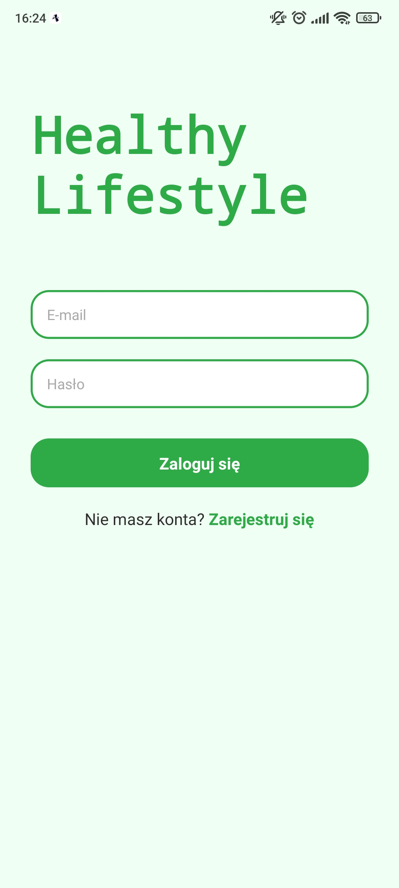
  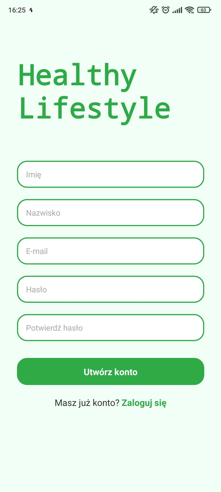
  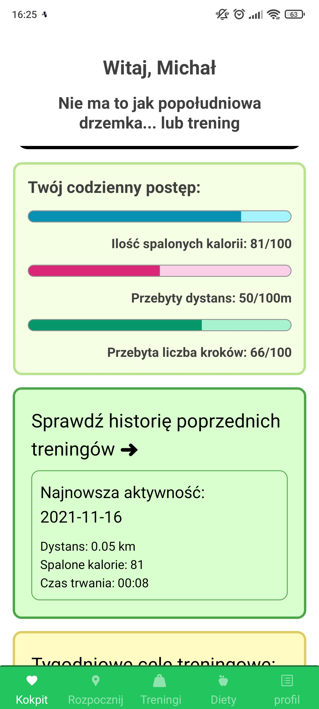
  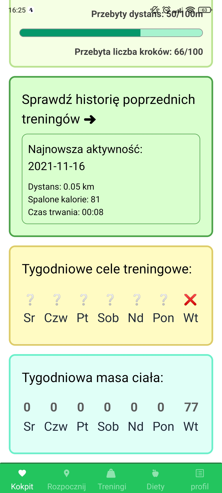
  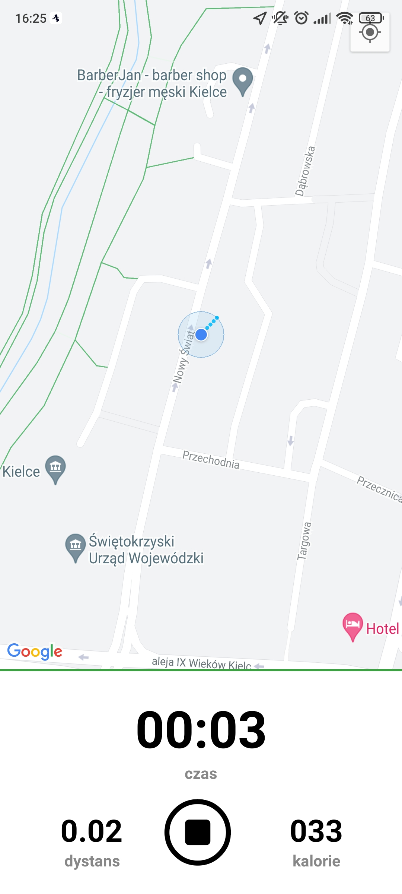
  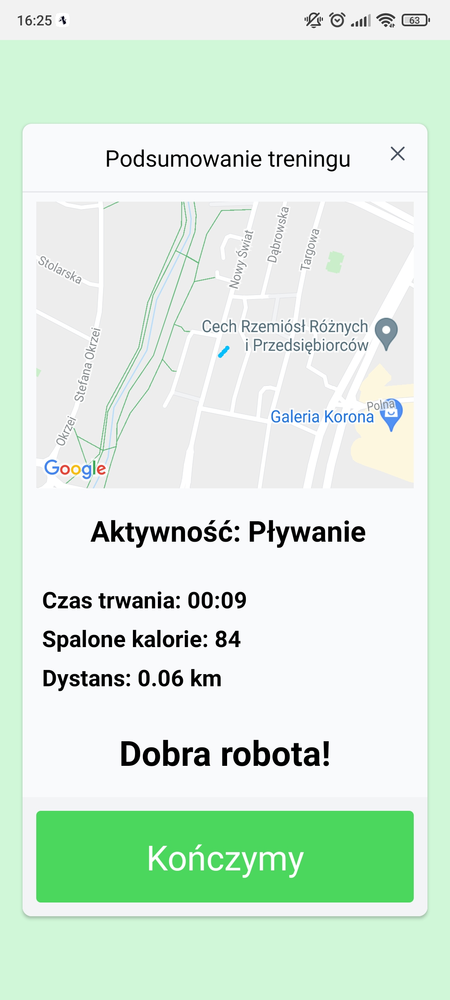
  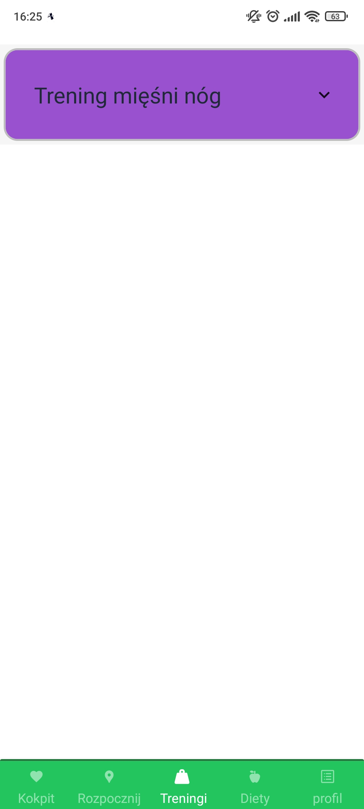
  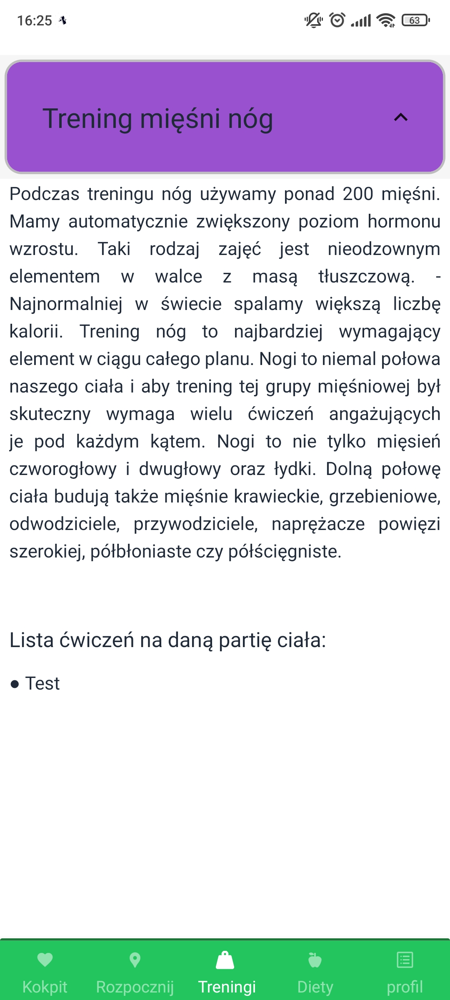
  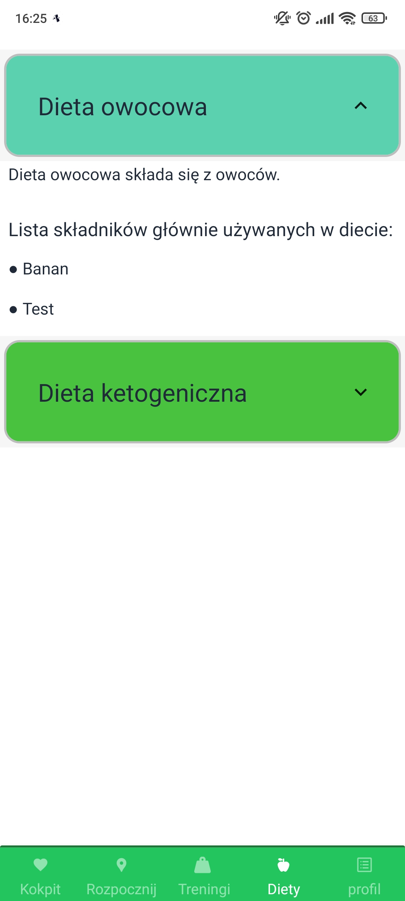
  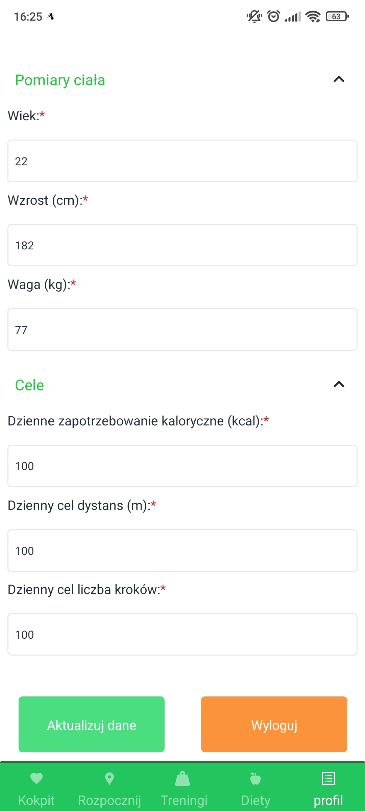
  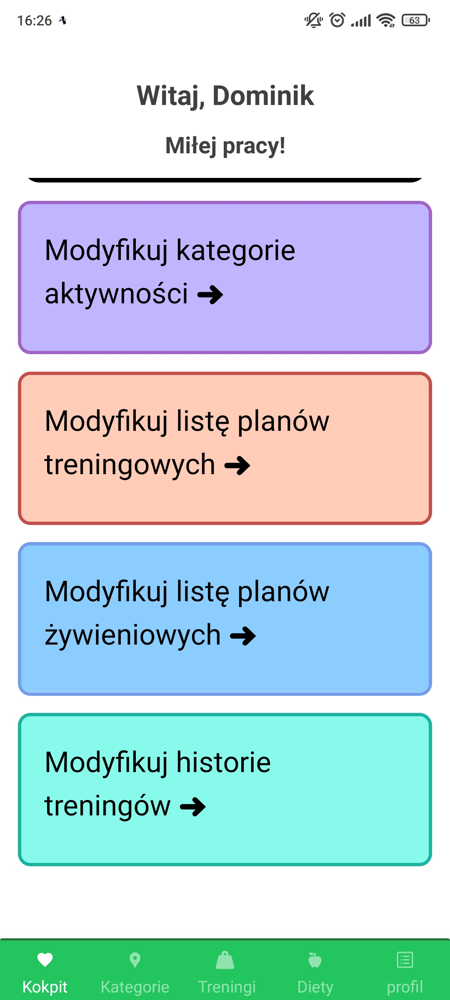
  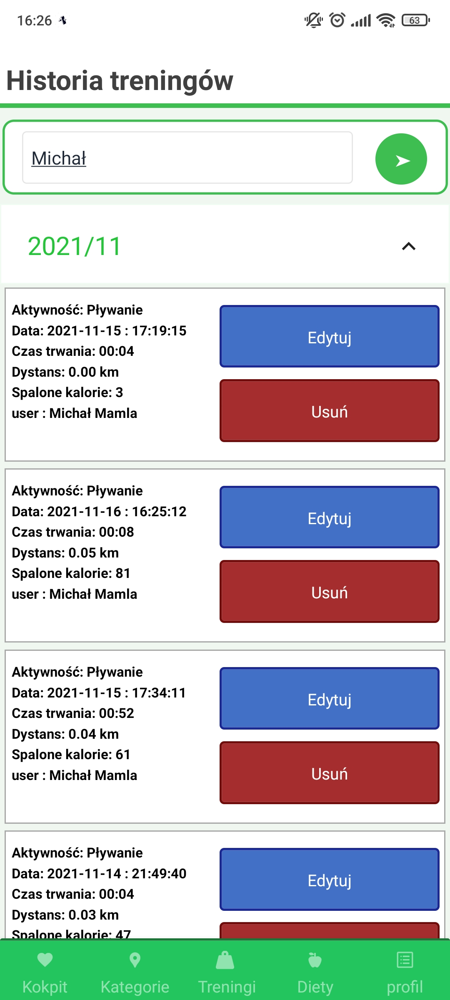
  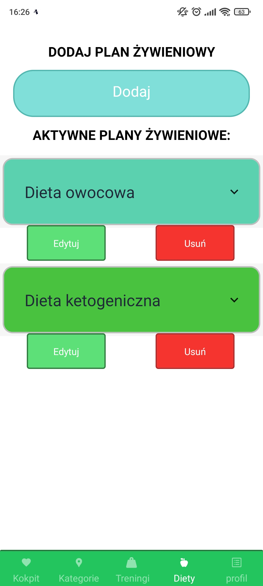
  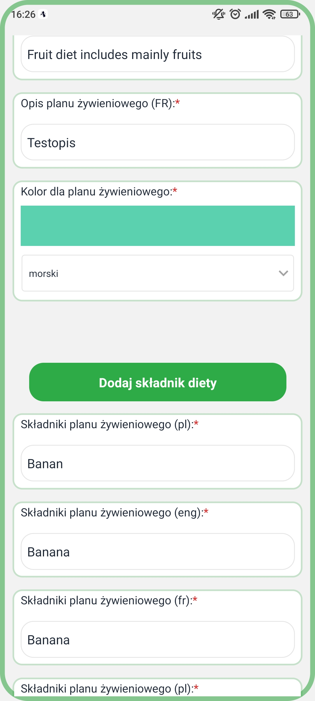
  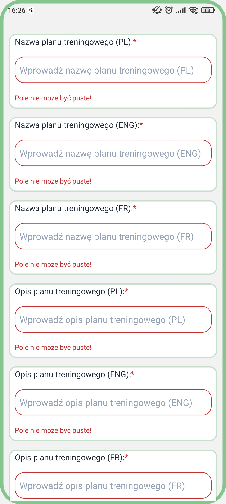
  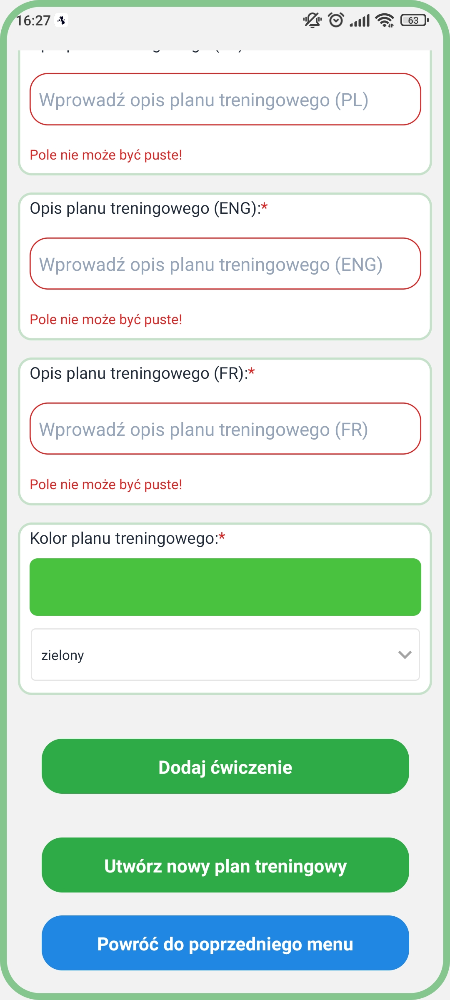
  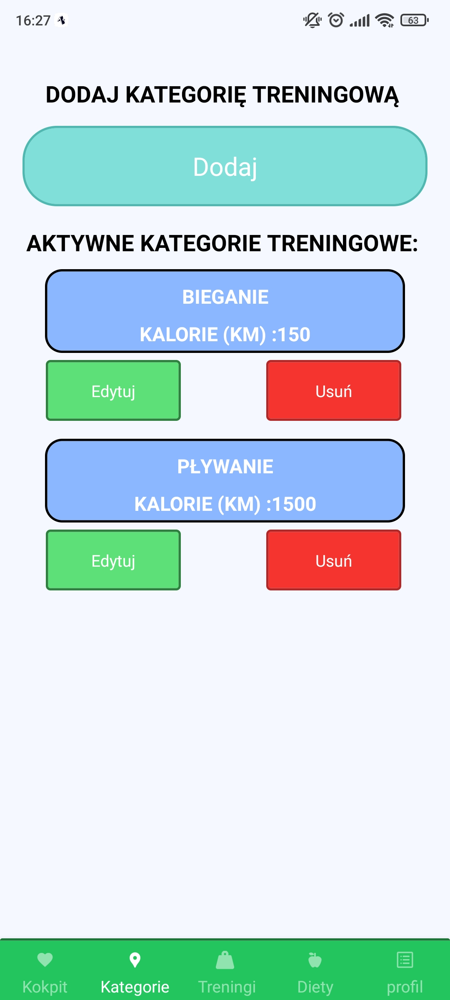
  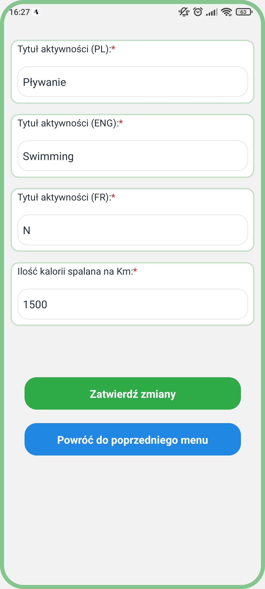

## Techstack:
- React 16.13
- Firebase 8.2.3
- Expo 42.0.0
- Javascript
- ES6
- CSS
- HTML

## Features
* register and login
* change user data
* dark/light theme
* multi language support
* attractive and simple design
* make trainings
* GPS tracking
* view diet and training plans
* see history of trainings
* track weekly goals
* track weight change

## Configuration
Download project and extract to your directory
Load project into your IDE like Intelij or Webstorm
Install NPM and Expo
Run on Expo Go application

## Status
This application is under construction.

## Contact

- Michał Mamla - https://github.com/bearyogi
